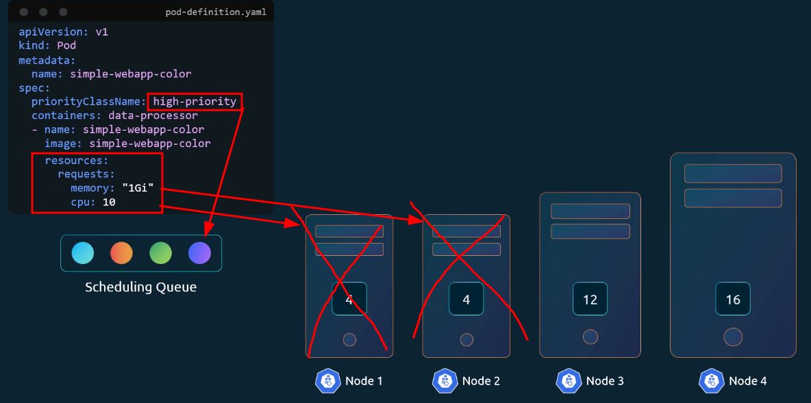
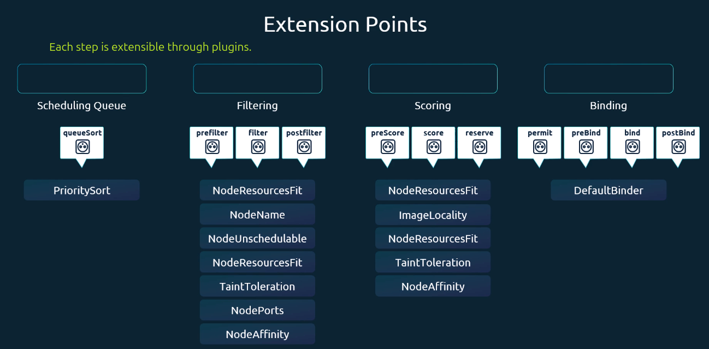

# Configuring Kubernetes Schedulers

- Take me to [video Tutorial](https://kodekloud.com/topic/configuring-kubernetes-scheduler/)

In this section, we will take a look at configuring kubernetes schedulers.

## How the scheduling works

1. A pod gets created and is added to a Scheduling Queue
2. The Queue is sorted based on priorityClass
3. Nodes are filtered out that cannot run the pods (based on its resource request) or by the nodeSelector of the Pod
4. Nodes are scored based on the free resources after the Pod is deployed on them
5. The Pod is bound to the node with the highest score

Each step is extensible by plugins:

## References

- <https://github.com/kubernetes/community/blob/master/contributors/devel/sig-scheduling/scheduling_code_hierarchy_overview.md>
- <https://kubernetes.io/blog/2017/03/advanced-scheduling-in-kubernetes/>
- <https://jvns.ca/blog/2017/07/27/how-does-the-kubernetes-scheduler-work/>
- <https://stackoverflow.com/questions/28857993/how-does-kubernetes-scheduler-work>
