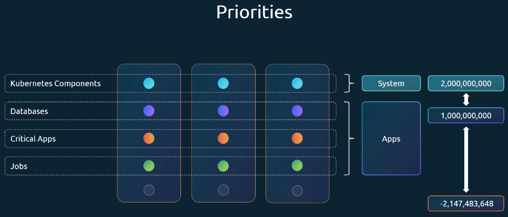
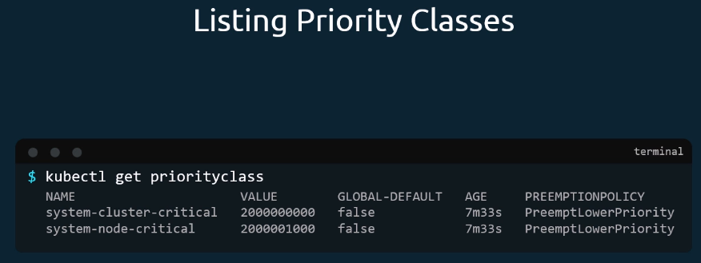
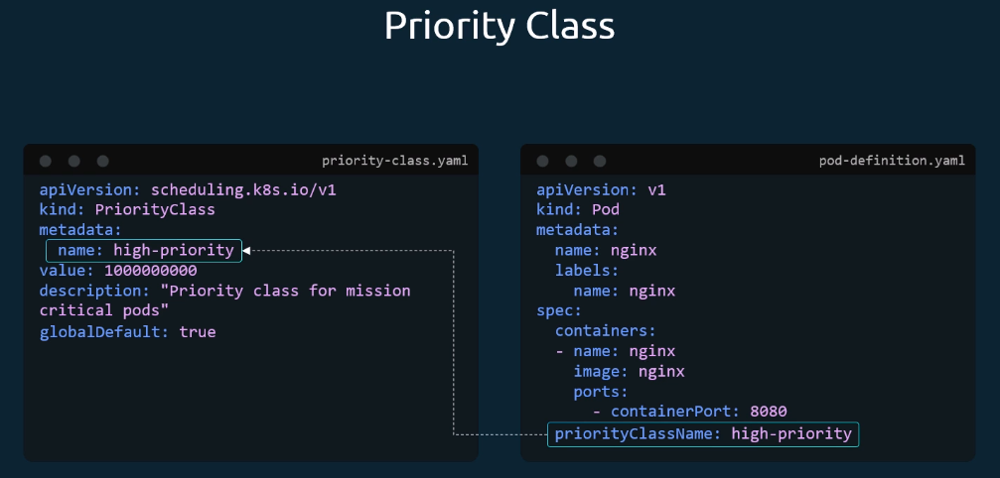
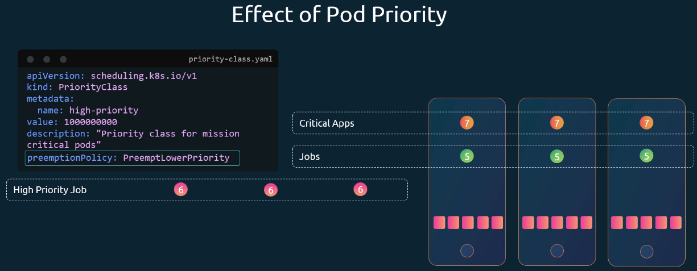

# Priority Classes

Kubernetes schedules Pods with different priorities. Some workloads always need to run (e.g. control components, database).
Priotity classes are not namespaced - they exist across all namespaces.


_priority classes have a numerical range, where higher number=higher priority. System components have a higher priority than Apps_.

List existing priority-classes:
`kubectl get priorityclasses`



Create Priority Class:

- first create a `priority-class.yaml:`

```yaml
apiVersion: scheduling.k8s.io/v1
kind: PriorityClass
metadata:
  name: high-priority
value: 1000000000
description: "Priority class for mission critical pods"
# usually, Pods haf default priority of 0.
# This option makes this new priority-class the default.
# Only one priority-class can have globalDefault=true
globalDefaul: true
```

- Then, assign the newly created priority-class to a Pod in the spec.priorityClassName property:

```yaml
apiVersion: v1
kind: Pod
metadata:
  name: nginx
  labels:
    name: nginx
spec:
  containers:
    - name: nginx
      image: nginx
      ports:
        - containerPort: 8080
  priorityClassName: high-priority
```



## Effect of Pod Priority

What happens if a higher priority Pods needs to be schedules but there are no resources left on the nodes?
It depends on the `preemptionPolicy` of the PriorityClass. If not specified, it's set to `PreemptLowerPriority`, so lower priority Pods get removed from the nodes to make space for the higher priority pod.


_here, the High Priority Job leads to preempting the Jobs with priority 5._

If `preemptionPolicy` is set to `never` in the PriorityClass, no preemption of existing workloads happens.

## Compare priorities of Pods

`kubectl get pods -o custom-columns="NAME:.metadata.name,PRIORITY:.spec.priorityClassName"`
