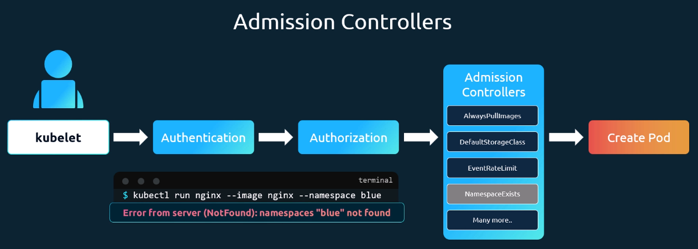
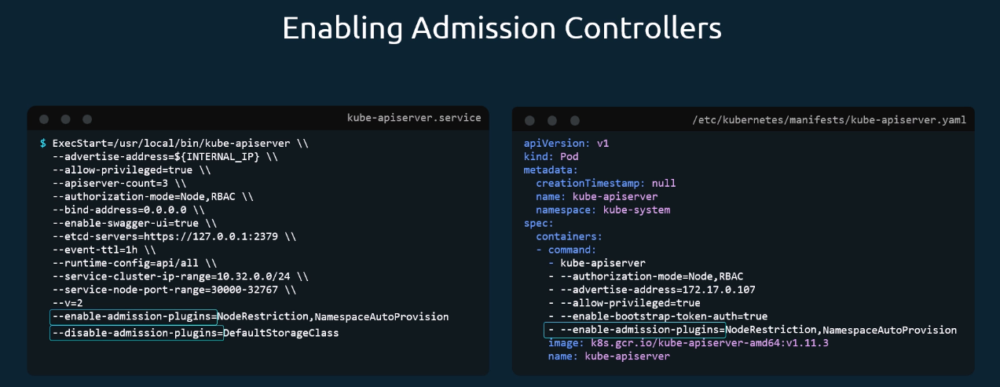

# Admission Controllers

Everytime we send a request, the request goes to the kube-apiserver, gets through authentication, authorization, an action is performed and relevant data is stored to the etcd datastore.

Authorization based on roles can controll what the user is allowed to do, for example:

Sometime you might want to achieve more fine grained control (like "a request must not create a new namespace"). This is where Admission Controllers come in.

_The NamespaceExists controller is enabled by default an prevents requests to create a namespace. If you want to change that, you can enable NamespaceAutoProvision in the Admission Controller._

## Viewing enabled Admission Controllers

`kube-apiserver -h | grep enable-admission-plugins`

## Enabling/Disabling Admission Controllers

Or use `kubectl exec -it kube-apiserver-controlplane -n kube-system -- kube-apiserver -h`.
If you ever forget where the kube-apiserver.yaml is:
`find ../ -name kube-apiserver.yaml`

`../` is for the getting to the root, might have to be adjusted

#### K8s Reference Docs

<https://kubernetes.io/docs/reference/access-authn-authz/admission-controllers/>
