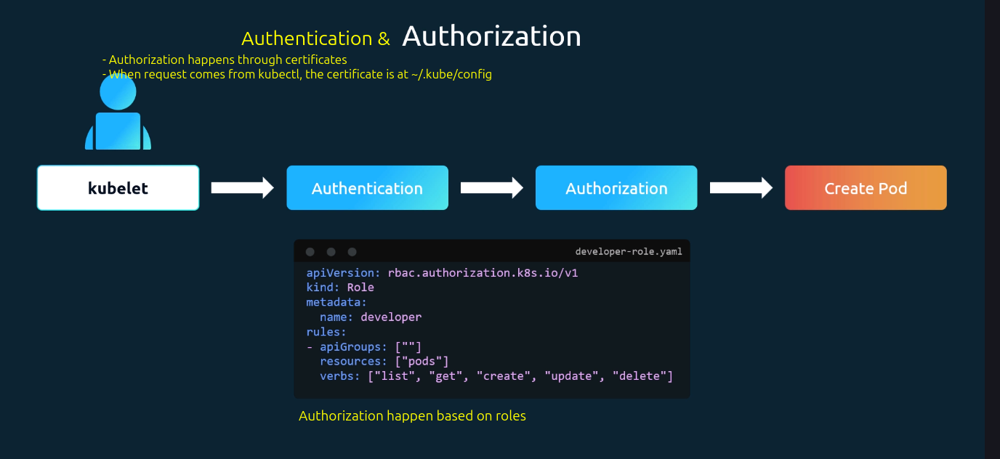
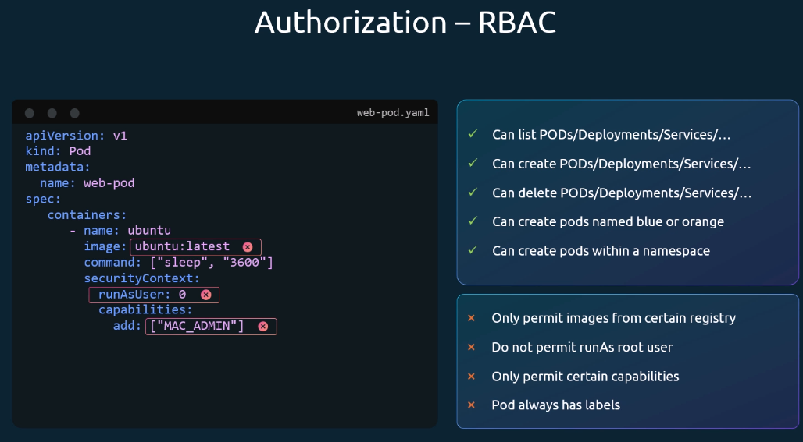

# Admission Controllers

Everytime we send a request, the request goes to the kube-apiserver, gets through authentication, authorization, an action is performed and relevant data is stored to the etcd datastore.

Authorization based on roles can controll what the user is allowed to do, for example:

Sometime you might want to achieve more fine grained controll (like "all Pods must have labels"). This is where Admission Controllers come in.
