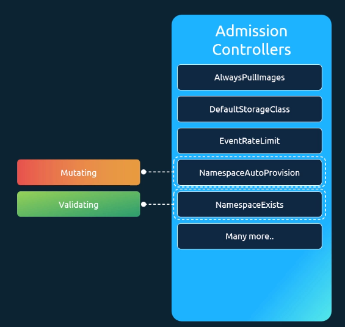
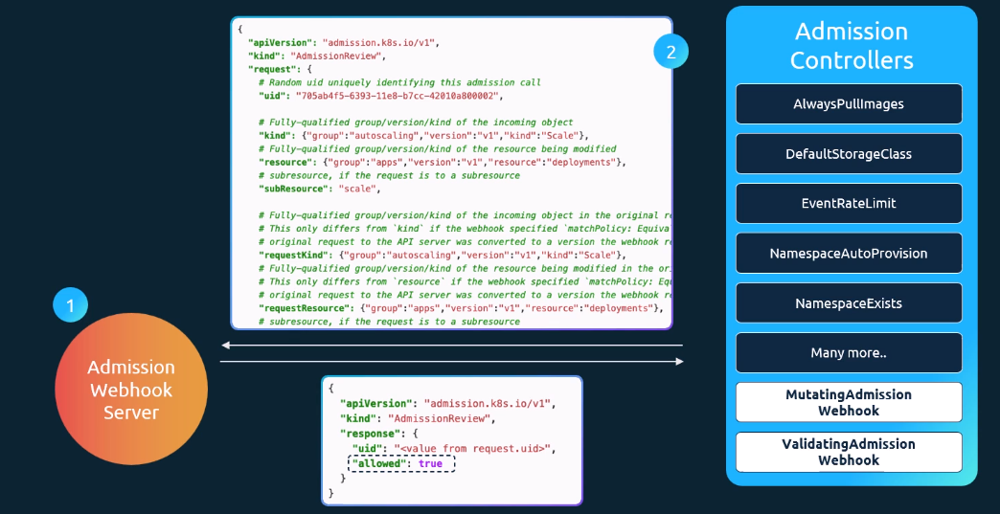
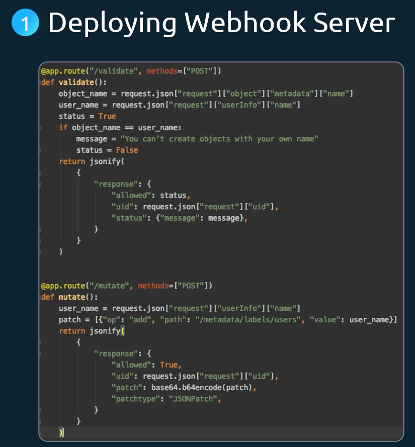

# Validating and Mutating Admission Controllers

There are two types of Admission Controllers:

1. Mutating Admission Controllers
   Mutate the request sent to the kube-apiserver before they pass it on.
   Example: NamespaceAutoProvision - it adjust the request such that also the creation of a new Namespace is added.
2. Validating Admission Controllers
   Validate the request sent to the kube-apiserver and decide if the request is accepted or rejected.
   Example: NamespaceExists - it checks if the namespace in the request exists and rejects the request if the Namespace does not exist.

It is important that first all Mutating Admission Controllers run before the Validating Admission Controllers run because then you can make sure that also the mutations performed by the Mutating Controllers are valid.



## Create and use your own Admission Webhook Server

If you want to implement custom logic for an Admission Controller, Kubernetes enables this through an Admission Webhook Server.



### Create Admission Webhook Server

The admission webhook server needs to implement the following workflow:

1. Accept a POST request with an AdmissionReview API object body
2. Perform custom logic - either mutations or validations
3. Send back a response that looks like this:

```json
{
  "apiVersion": "admission.k8s.io/v1",
  "kind": "AdmissionReview",
  "response": {
    "uid": "<value from request.uid>",
    "allowed": true
  }
}
```


_Example of a webhook server in Python that implements mutation and validation_

### Use Admission Webhook Server

- you need to tell kube-apiserver to use your Admission Webhook Server during the when processing requests
- To do this, you
  - deploy the Webhook Server as Pod in your cluster
  - create a Service (ClusterIP) to make the Pod available
  - Create a `MutatingWebhookConfiguration` / `ValidatingWebhookConfiguration`:

  ```yaml
  apiVersion: admissionregistration.k8s.io/v1
  kind: ValidatingWebhookConfiguration # OR MutatingWebhookConfiguration
  metadata:
    name: "pod-policy.example.com"
  webhooks:
    - name: "pod-policy.example.com"
      rules: # tell kubernetes when it should use the webhook
        - apiGroups: [""]
          apiVersions: ["v1"]
          operations: ["CREATE"]
          resources: ["pods"]
          scope: "Namespaced"
      clientConfig:
        # alternative to service:
        # Just provide a URL like https://my-admission-webhook.com/validate
        service:
          namespace: "example-namespace"
          name: "example-service"
        caBundle: <CA_BUNDLE>
      admissionReviewVersions: ["v1"]
      sideEffects: None
      timeoutSeconds: 5
  ```

  > Note:
  > You must replace the <CA_BUNDLE> in the above example by a valid CA bundle which is a PEM-encoded CA bundle for validating the webhook's server certificate.

#### K8s Reference Docs

<https://kubernetes.io/docs/reference/access-authn-authz/extensible-admission-controllers/>
