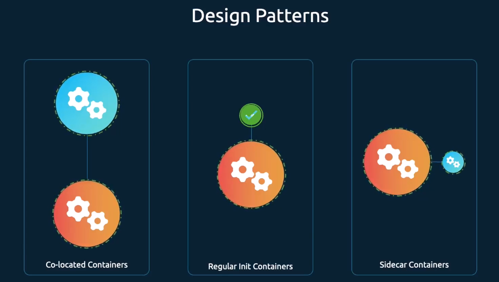
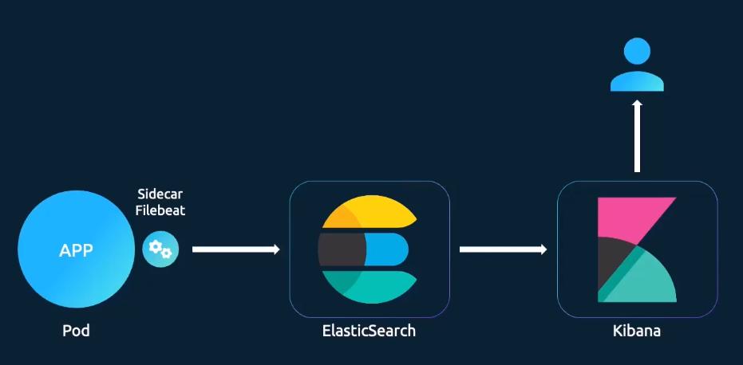

# Multi-Container Pods Design Patterns

- Take me to [Design Pattern page](https://kodekloud.com/topic/multi-container-pods-design-patterns/)




- Co-located containers: used when to services depend on each other
- Regular Init Containers: used when initialization steps need to be performed before the main application starts (e.g. start database)
- Sidecar Containers: used when you have something that needs to start before the main app and run along the main app and end after the main app ends (e.g. log collector)

Difference between co-located containers and Sidecar containers:
Co-located containers are started in parallel, there is no defined startup order

## Co-located containers

```yaml
apiVersion: v1
kind: Pod
metadata:
  name: simple-webapp
  labels:
    name: simple-webapp
spec:
  containers:
    - name: web-app
      image: web-app
      ports:
        - containerPort: 8080
    - name: main-app
      image: main-app
```

## Regular Init Containers

```yaml
apiVersion: v1
kind: Pod
metadata:
  name: simple-webapp
  labels:
    name: simple-webapp
spec:
  containers:
    - name: web-app
      image: web-app
      ports:
        - containerPort: 8080
  initContainers:
    - name: db-checker
      image: main-app
      command: "wait-for-db-to-start.sh"
```

## Sidecar containers

```yaml
apiVersion: v1
kind: Pod
metadata:
  name: simple-webapp
  labels:
    name: simple-webapp
spec:
  containers:
    - name: web-app
      image: web-app
      ports:
        - containerPort: 8080
  initContainers:
    - name: db-checker
      image: main-app
      command: "setup-log-shipper.sh"
      restartPolicy: Always
```

### More realistic example for Sidecar container

Elastic Search + Kibana Stack



#### K8s Reference Docs

- <https://kubernetes.io/blog/2015/06/the-distributed-system-toolkit-patterns/>
