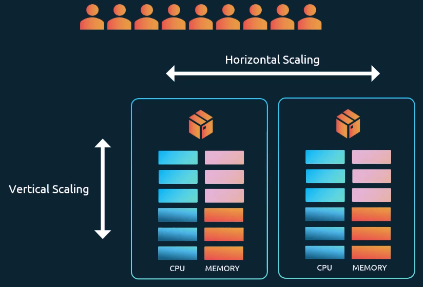
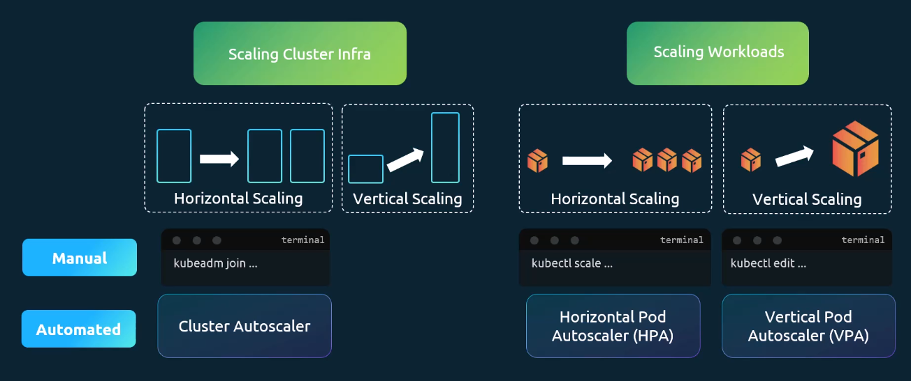

# Introcution to Autoscaling

In the past: What happens when the load on the application increased?

- **Vertical scaling** (if application runs on single server): Shut down server, increase the size (CPU, memory) of the server
- **Horizontal scaling** (if Application runs on multiple servers): Adding more servers
  

## In the Kubernetes World

There are two types of scaling:

1. Scale underlying cluster infrastructure itself: Add or remove servers
1. Scale workloads: Add or remove containers/pods to the cluster

### Scaling Cluster Infra

- Horizontal: Add more nodes to the cluster
  - Manual: `kubeadm join`... --> not done normally
  - Automated: Cluster Autoscaler
- Vertical: Increase resources on existing nodes

### Scaling Workloads

- Horizontal: Add more pods
  - Ways to perform scaling:
  - Manual: `kubectl scale`...
  - Automated: Horizontal Pod Autoscaler (HPA)
- Vertical: Allocate more resources to existing pods
  - Manual: kubectl edit
  - Automated: Vertical Pod Autoscaler (VPA)

