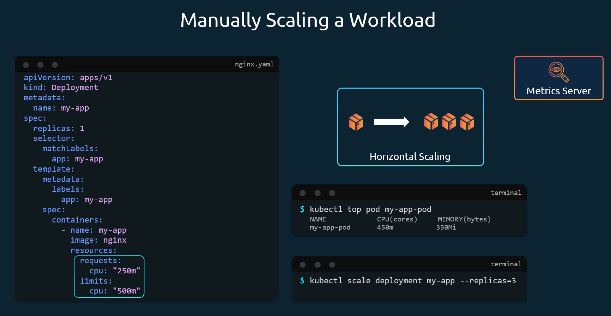
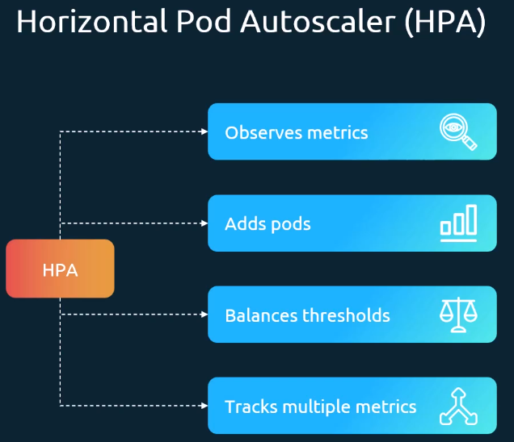
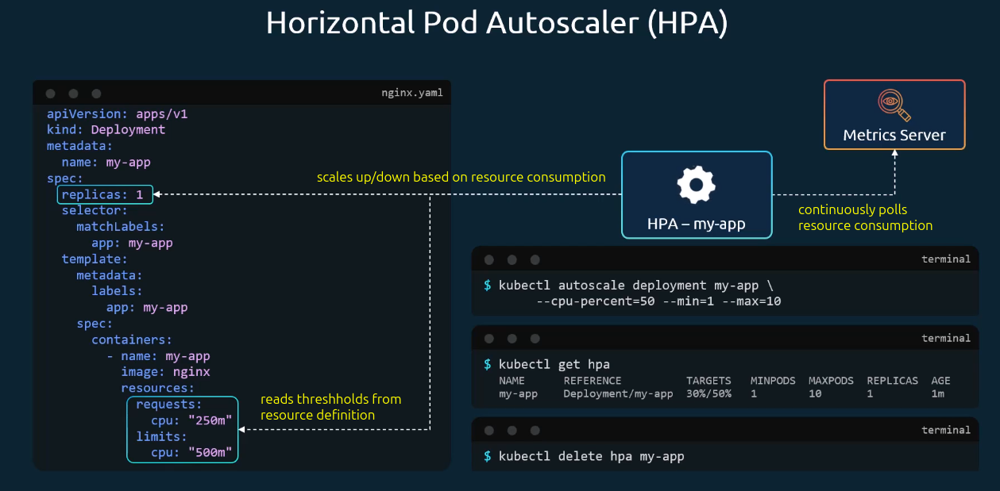
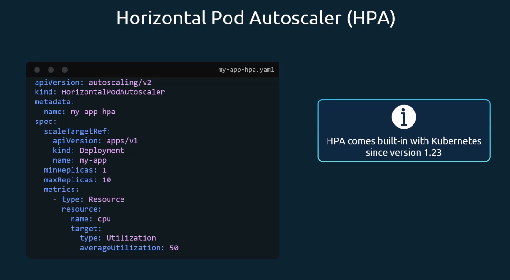

# Horizontal Pod Autoscaler (HPA)

## Manual Scaling a Workload

For manual scaling, you would have to continuously watch the output of `kubectl top pod my-app-pod` and scale with `kubectl scale deployment my-app --replicas=<numbebr>`.
That is not feasible.


## Horizontal Pod Autoscaler

Instead of manual scaling, you can utilize a Horizontal Pod Autoscaler (HPA).
It can observe multiple metrics and create/remove Pods accordingly.



### HPA Imperative Approach



### HPA Declarative Approach



Example HorizontalPodAutoscaler Definition:

```yaml
apiVersion: autoscaling/v2
kind: HorizontalPodAutoscaler
metadata:
  name: php-apache
spec:
  scaleTargetRef:
    apiVersion: apps/v1
    kind: Deployment
    name: php-apache
  minReplicas: 1
  maxReplicas: 10
  metrics:
    - type: Resource
      resource:
        name: cpu
        target:
          type: Utilization
          averageUtilization: 50
```
