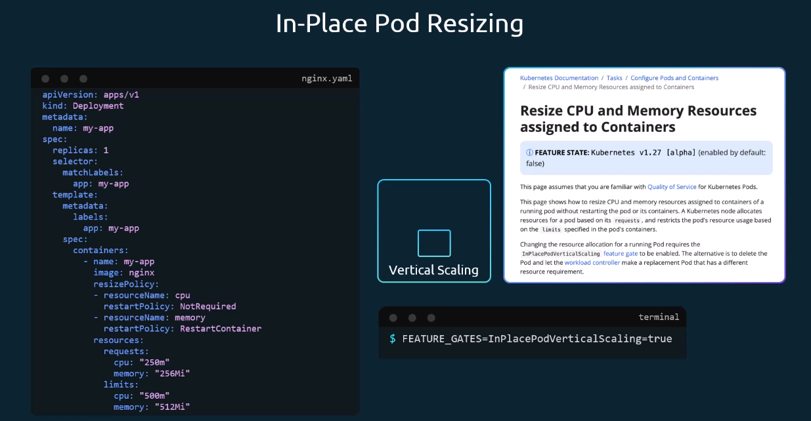
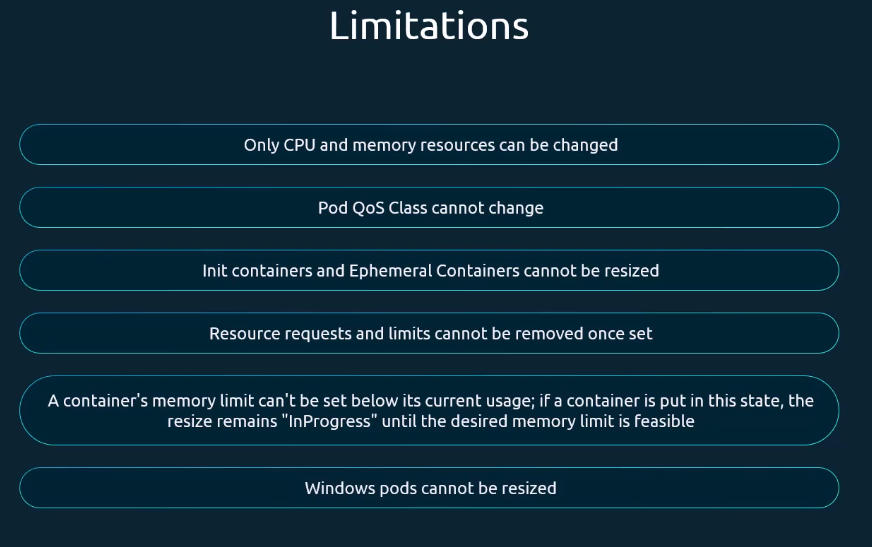

# In-Place Resize of Pods

When you change the resource properties of a Pod, kubernetes implements the new resource requirements by restarting the Pod with the changes applied.
This can be a problem for stateful workloads.

To accomodate for this issue, a new feature can be activated through the feature flag `InPlacePodVericalScaling=true`.
With the feature enabled, you can use the new `.spec.template.spec.containers[].resizePolicy` property:

## Limitations

