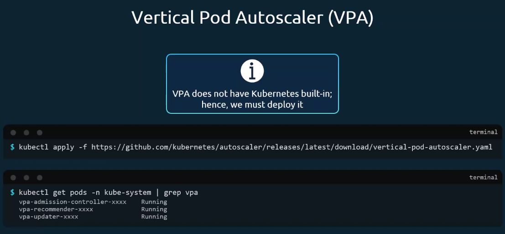
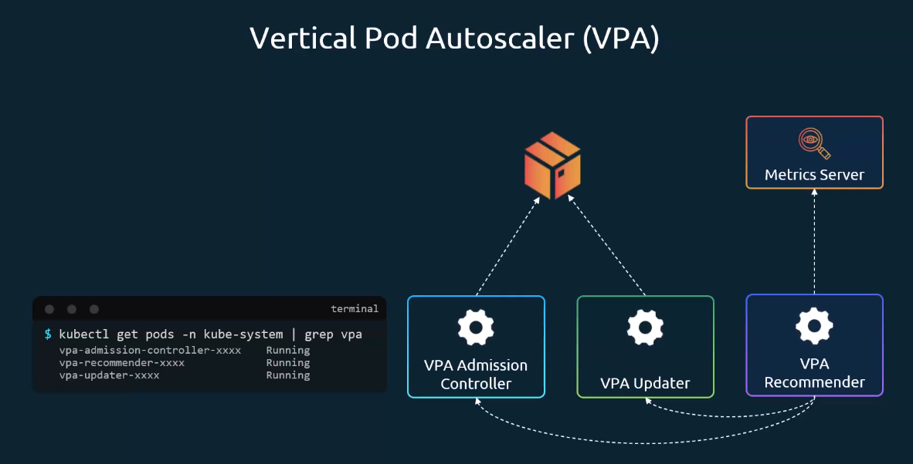
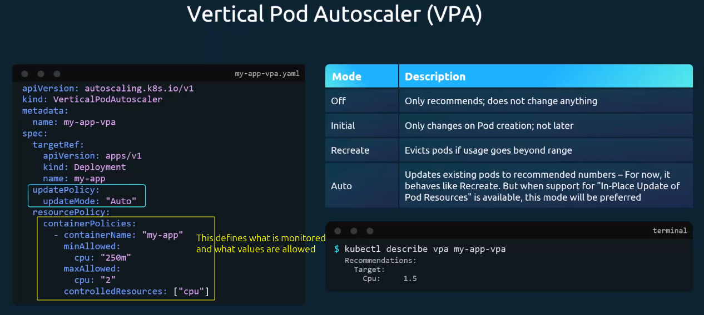
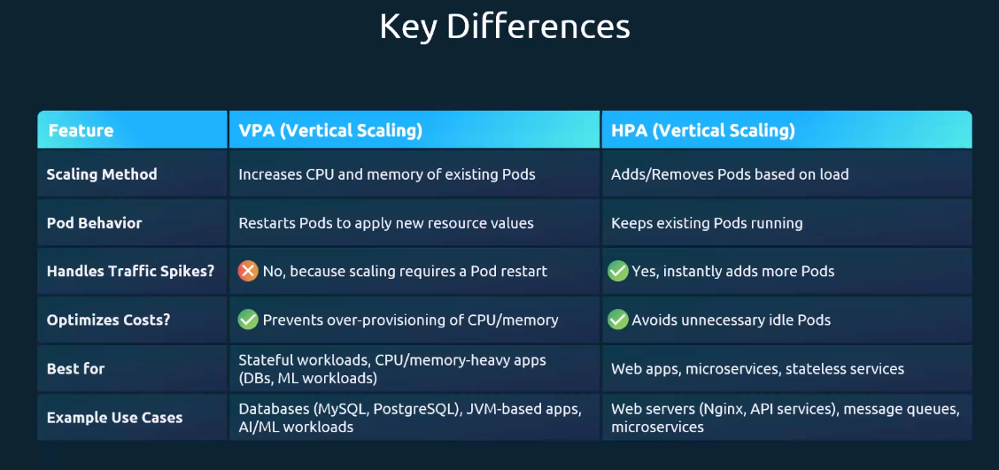

# Vertical Pod Autoscaling (VPA)

- Kubernetes does not come with VPA built-in, we must deploy it
- VPA consists of a Recommender, an Updater and an Admission Controller

- VPA Recommender monitors the metric server and suggests changes based on observed metrics on cpu and memory values
- the VPA Updater detects Pods that run with suboptimal resources and evicts (e.g. terminates) them if they don't align with the resource definitions
- the VPA Admission controller intercets new Pods creations and applies the recommended changes to the Pod resources before creation

## Differences between VPA and HPA

### Solution to Labs

What VPA CRDs get installed?
Run `kubectl get crd`

#### Last question in Lab

You have recently deployed a Flask application to your Kubernetes cluster. However, the Vertical Pod Autoscaler (VPA) vpa-updater-XXXX pod indicates that there may be an issue with the newly deployed flask-app pods.

Inspect the logs of the vpa-updater-XXXX pod and observe the following message:

pods_eviction_restriction.go:226] **too few replicas** for **ReplicaSet** default/**flask-app-b6c9c4f78**

Problem Analysis:

- Flask application is running with only 1 replica pod.
- The Vertical Pod Autoscaler (VPA) needs to evict (remove) the existing pod to create a new one with updated resource settings.
- Kubernetes has a safety feature that prevents removing the last pod of a deployment to avoid service downtime.
- When you have only 1 replica and VPA tries to evict it, Kubernetes blocks this action with the error message: "too few replicas".
- VPA wants to optimize your pod's resources but cannot because Kubernetes is protecting your service availability.
- As a result, VPA cannot apply its resource recommendations, and application cannot benefit from automatic resource optimization.

**Approach to Resolve the Issue:**

1. Increase the replica count:

   `kubectl scale deployment flask-app --replicas=2`

2. Verify the Deployment:

   `kubectl get deployment flask-app -o wide`

   Ensure that the DESIRED column shows the updated replica count, and the CURRENT column matches the desired number.

3. Check the Pod Status:

   `kubectl get pods -l app=flask-app`

   Wait until all pods show Running status.
   You should see two pods (or more) in a Running state.

4. Verify VPA operation:

   `kubectl describe vpa flask-app`

This will show the current state of the VPA and any recommendations it has made. If it's working properly, you should see resource recommendations (for CPU and memory) in the output.

With 2 replicas, Kubernetes can safely remove one pod while keeping your application running, allowing VPA to work properly.
