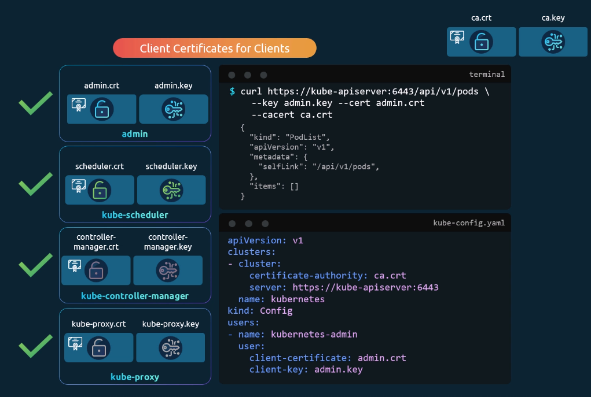

# TLS in kubernetes - Certificate Creation

- Take me to [Video Tutorial](https://kodekloud.com/topic/tls-in-kubernetes-certificate-creation/)

In this section, we will take a look at TLS certificate creation in kubernetes

## Generate Certificates

- There are different tools available such as easyrsa, openssl or cfssl etc. or many others for generating certificates.

## Certificate Authority (CA)

- Generate Keys

  ```
  openssl genrsa -out ca.key 2048
  ```

- Generate CSR

  ```
  openssl req -new -key ca.key -subj "/CN=KUBERNETES-CA" -out ca.csr
  ```

- Sign certificates

  ```
  openssl x509 -req -in ca.csr -signkey ca.key -out ca.crt
  ```


## Generating Client Certificates

#### Admin User Certificates

- Generate Keys

  ```
  openssl genrsa -out admin.key 2048
  ```

- Generate CSR

  ```
  openssl req -new -key admin.key -subj "/CN=kube-admin" -out admin.csr
  ```

- Sign certificates

  ```
  openssl x509 -req -in admin.csr -CA ca.crt -CAkey ca.key -out admin.crt
  ```

  

How to differentiate the admin-user from normal users?

- add the system:masters to the group details as follows
- Certificate with admin privileges

  ```
  openssl req -new -key admin.key -subj "/CN=kube-admin/O=system:masters" -out admin.csr
  ```

#### We follow the same procedure to generate client certificate for all other components that access the kube-apiserver


_kube-scheduler is a system component and a part of the kubernetes control plane, so its name is prefixed with `system:`_


_kube-controller is also a system component and gets the prefix `system:`_


What do you do with those client certificates?

- provide them as arguments when authenticating against the kube-apiserver in a `curl` command
- or, instead of using them as command line args, puth them into a config file `kube-config.yaml`
  

**Everyone needs the ca.crt (CA root certificate) to verify all other certificates.**

## Generating Server Certificates

## ETCD Server certificate


_etcd server can be deployed as a cluster across multiple servers. Then, you need to issue additional peer certificates and specify them when starting the etcd service_


## Kube-apiserver certificate


_the kube-apiserver is popular and everyone talks to it. It goes with multiple names and all those names need to be resolvers to the kube-apiserver. This is why the `[alt_names]` is specified inside an additional `openssl.cnf` file_


## Kubectl Nodes (Server Cert)


## Kubectl Nodes (Client Cert)


