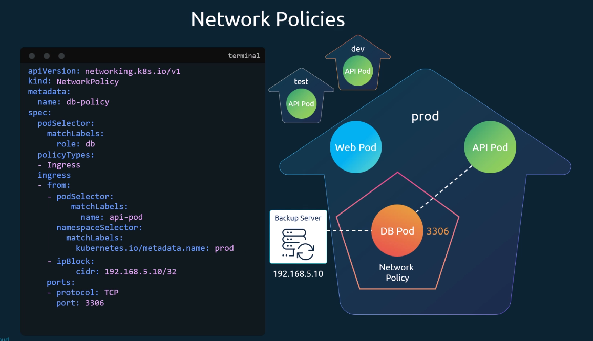

# Network Policies

- Take me to [Video Tutorials](https://kodekloud.com/topic/network-policies-3/)

#### Trafic flowing through a webserver serving frontend to users an app server serving backend API and a database server


- There are two types of traffic
  - Ingress
  - Egress

  

  

## Network Security


## Network Policy


## Network Policy Selectors


## Network Policy Rules


## Create network policy

- To create a network policy

  ```
  apiVersion: networking.k8s.io/v1
  kind: NetworkPolicy
  metadata:
   name: db-policy
  spec:
    podSelector:
      matchLabels:
        role: db
    policyTypes:
    - Ingress
    ingress:
    - from:
      - podSelector:
          matchLabels:
            role: api-pod
      ports:
      - protocol: TCP
        port: 3306
  ```

  ```
  kubectl create -f policy-definition.yaml
  ```




- namespaceSelector: limit ingress to pods from namespace prod
- ipBlock: allow ingress from server outside the kubernetes cluster
- Each rule is combined with an OR. multiple selectors in one rule (like podSelector+namespaceSelector in screenshot) are combined with AND

### Example for Egress with ports per rule

```yaml
apiVersion: networking.k8s.io/v1
kind: NetworkPolicy
metadata:
 name: internal-policy
spec:
  podSelector:
    matchLabels:
      role: internal
  policyTypes:
  - Egress
  egress:
  - to:
    - podSelector:
        matchLabels:
          name: payroll
    ports:
    - protocol: TCP
      port: 8080
  - to:
    - podSelector:
        matchLabels:
          name: mysql
    ports:
    - protocol: TCP
      port: 3306
    ports:
    - protocol: TCP
      port: 53
    - protocol: UDP
      port: 53
```

## Note


#### Additional lecture on [Developing Networking Policies](https://kodekloud.com/topic/developing-network-policies/)

#### K8s Reference Docs

- <https://kubernetes.io/docs/concepts/services-networking/network-policies/>
- <https://kubernetes.io/docs/tasks/administer-cluster/declare-network-policy/>
